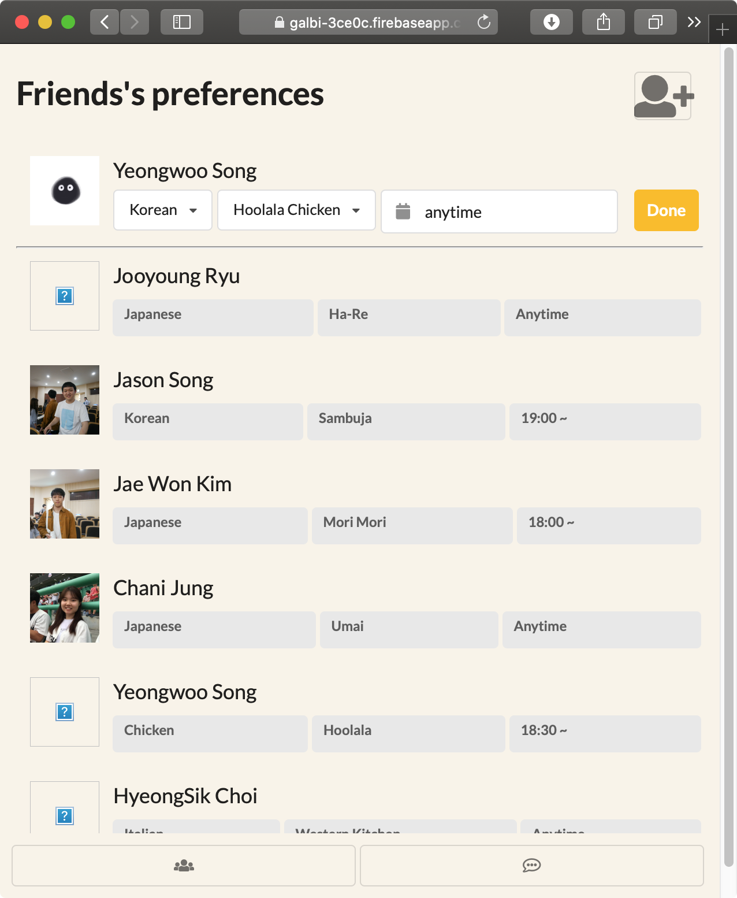
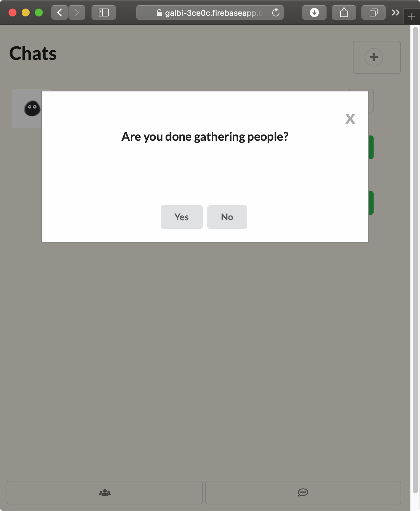
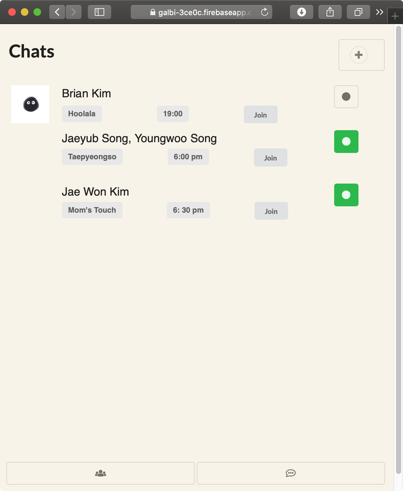
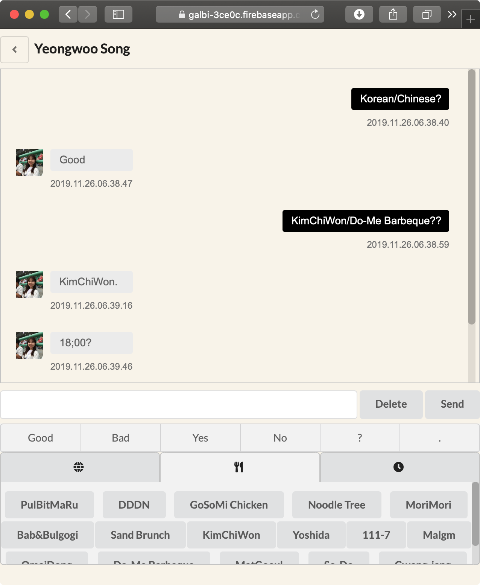

# Team 흑당마라갈비
# High-fi Prototype
20150187 김재원

20160319 송영우

20160796 김우재

20160801 김채원

Project Summary
---------------
1) The steps taken from finding meal buddies in chat rooms to actually meeting them are too inefficient and burdensome.

2) Our solution is to provide a platform where users can express their meal plans and make meal arrangements with their friends efficiently.

3) Different from other social interaction platforms, our platform is dedicated only to making meal arrangements and communicating only on that topic specifically.

Important Links
---------------
[Prototype Link](https://galbi-3ce0c.firebaseapp.com) - https://galbi-3ce0c.firebaseapp.com

[GitHub Link](https://github.com/wkim97/CS473) - https://github.com/wkim97/CS473

Instruction
-----------

Our application is aimed at providing users with a service to arrange a group to eat with more easily and efficiently. First the user is asked to enter his/her login info, or their name and password.

<left>

After the login, the user is directed to "Friends" tab, as shown in the image above. On this screen, the user can see friends’ meal preferences and also register his or her own meal preferences.

<left></left>
<right></right>
By clicking on the "chats" UI button on the bottom right corner, the user can move on to the "chats" tab. In this section, user can open up a chat room by clicking on "plus" button on the top right corner. The user can then register his/her meal plans on the pop-up screen. Clicking "done" will create a new chat room, and this new chat room will also be shown on other users' chats sections. User can always join the chat room by clicking the respective room's "join" button. As shown above, with our active status feature, the user can confirm that he/she is done gathering members for a specific meal and also see whether other meal plans are still available!

<left>

By clicking on the chat room itself on the chats tab, the user can enter the chatting platform. In this room, conversation is made through keywords. The user can express his or her preference of cuisine type, restuarant, and time. The screenshot above shows that our service provides users with a pool of conversation tools related only to eating and meal arrangements with a keyboard of keywords.

Libraries and Frameworks Used
-----------------------------
* HTML - to implement basic UI for web pages
* Semantic UI - for cleaner and smoother UI
* javascript - to deal with data on web pages and to perform simple tasks
* CSS - to align UI features such as buttons and icons
* Firebase - works both as database and server so that we can store data and also call data from it
* jQuery - for javascript tools such as JSON

Individual Reflections
----------------------
#### 20150187 김재원
-------------------
My main part was back-end. I mainly did designing database schema, managing DB data on server, making core codes about communicate to database and showing new chat on the page when it is arrived.

Last year, I took "Introduction of Database" course, and I experienced very simple SQL query and back-end using jQuery. However, firebase is NoSQL database, in other words, firebase doesn't need database tables. I confused to add new data to database without strict rules. At the last, since every single web pages have different data structure, I changed and rebuild database structure.

The Big achievement while making High-Fi prototype is that I can read and understand other’s code and adapt to my code faster than before. Since we didn’t prepare compatibility between back-end code and front-end code, replacing from hard coded data in front-end code to database data is very important and tough job.

#### 20160319 송영우
-------------------
I worked on the front-end of our service, especially the UI inside the chatroom. I designed the overall interface of the chatroom, and implemented the keyword-based chatting system.

It was my first time to develop a web page, so I had troubles designing and styling each elements of our platform. It was hard to place and align the components that I intended to do at the first place. However, I've got to designing the interface by organizing the nested components one by one, and putting in order the inherited attributes.

The main thing I struggled on was developing the keyword-based conversation. First, fetching the data from keyword-button clicking action, and then appropriately parsed the input data so that users can smoothly chat with the given keyword-buttons, rather than having keyboard to enter texts.

#### 20160796 김우재
-------------------
I mainly worked on the back-end of the developing process. I took care of storing data to the database and calling in data from database on the UI web page that has been established by teammates. I also arranged the database structure and created mappings among the html pages. I took care of the back-end process on friends.html and chats.html.

Since I, along with my teammates, was totally new to designing and building web pages, I had to start development process from the scratch. Main difficulty came from unfamiliarity - I had to search every components of HTML and javascript, ranging from syntax to storing data to Firebase and also calling it in onto webpage in a real-time basis. This slowed down our development process, but my work efficiency boosted towards the end, as I became more familiar with web development tools and know-hows.

One useful skill I have learned while working on the high-fi prototype is designing a basic database structure for web pages and using html/javascript to manipulate data in the database structure. I learned to efficiently structure database so that it is easier to store to the database and also call data from it to use on the UI. 

#### 20160801 김채원
-------------------
I worked as a front-end programmer, implementing the friends list page and chat list page, using HTML, Javascript, and CSS. I designed the overall UI of the friends and chat list, and the basic features of the tasks that could be navigated without back-end development. Once back-end was established, I unified and fixed the overall UI design.

I was new to web development, so I had to learn HTML and javascript. Since HTML has a lot of elements, it was difficult to decide on which element to use for the features, and to make the elements visually appealing. Also, the most difficult part was dynamically changing the content of HTML through javascript.

I learned to make a basic static website without back-end support through HTML and javascript, and how to use modules and elements that are provided by external framework, such as Semantic UI
